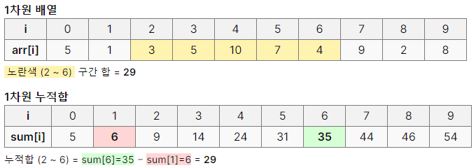
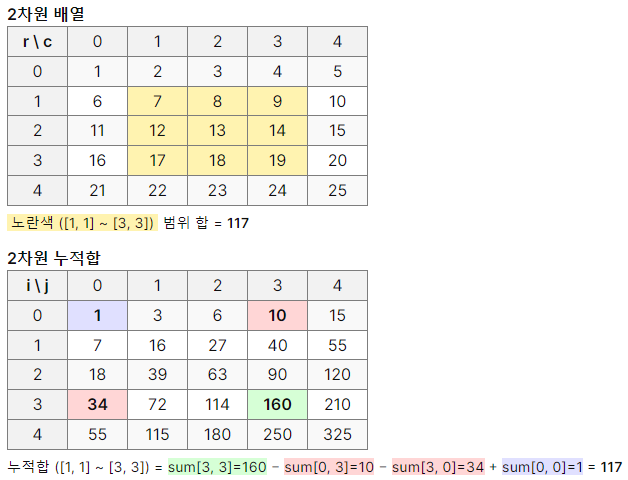
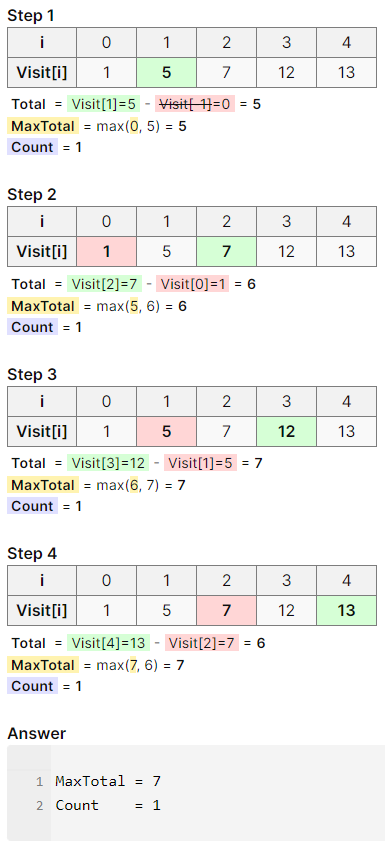
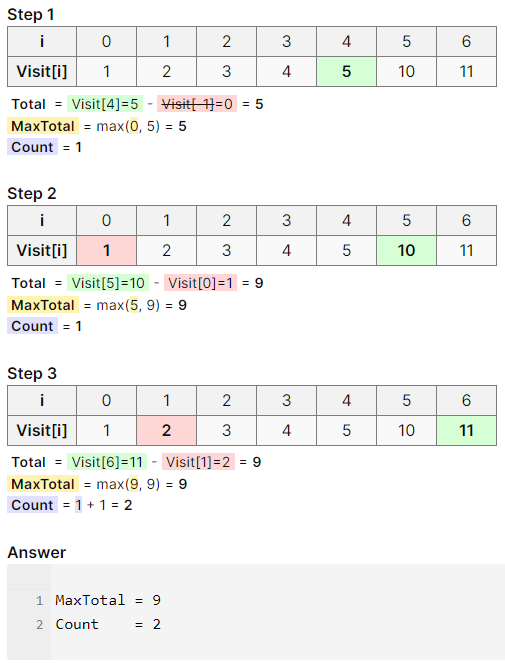

# 목차

- [누적합 (`Prefix Sum`) 이란?](#누적합-prefix-sum-이란)
    - [1차원 배열의 누적합 예제](#1차원-배열의-누적합-예제)
    - [2차원 배열의 누적합 예제](#2차원-배열의-누적합-예제)
- [\[Silver III\] 블로그 - 21921](#silver-iii-블로그---21921)
    - [1. 슬라이딩 윈도우](#1-슬라이딩-윈도우-sliding-window)
    - [2. 응용](#2-응용)
- [Reference](#reference)
    - [Tags](#tags)

---

# 누적합 (`Prefix Sum`) 이란?

> 누적합(Prefix Sum)은 배열의 특정 구간 합을 빠르게 계산하기 위한 알고리즘으로, 각 인덱스까지의 누적합을  
> 미리 계산하여 저장해두고, 구간 합 계산 시 저장된 값을 이용해 시간 복잡도를 $O(1)$로 단축할 수 있습니다.
>
> 이 방법은 동적 계획법(DP)의 형태로, 원래 $O(N^{2})$ 또는 $O(N\cdot{M})$의 시간이 걸리던  
> 구간 합 계산을 효율적으로 수행하게 해줍니다.

---

## ***1차원 배열의 누적합 예제***

```cpp
int arr[10] = { 5, 1, 3, 5, 10, 7, 4, 9, 2, 8 };
```

- **1차원 배열의 누적합 공식**

$$
\Large
\text{sum}[i] =
\overset{ \color{gray} \text{(현재 위치의 값)} }{ \text{arr}[i] } +
\overset{ \color{gray} \text{(이전 누적합)} }{ \text{sum}[i - 1] }
$$

| **index**         | `0` | `1` | `2` | `3` | `4` | `5` | `6` | `7` | `8` | `9` |
|-------------------|-----|-----|-----|-----|-----|-----|-----|-----|-----|-----|
| **Value (`arr`)** | 5   | 1   | 3   | 5   | 10  | 7   | 4   | 9   | 2   | 8   |
| **Sum (`sum`)**   | 5   | 6   | 9   | 14  | 24  | 31  | 35  | 44  | 46  | 54  |

- **특정 범위 내의 누적합 공식**

$$
\Large
\overset{ \color{gray} \text{range}(x_{1}, \ x_{2}) }{ \text{sum}[x_{2}] - \text{sum}[x_{1} - 1] }
$$



---

## ***2차원 배열의 누적합 예제***

```cpp
int arr[5][5] = {
	{  1,  2,  3,  4,  5 },
	{  6,  7,  8,  9, 10 },
	{ 11, 12, 13, 14, 15 },
	{ 16, 17, 18, 19, 20 },
	{ 21, 22, 23, 24, 25 }
};
```

- **2차원 배열의 누적합 공식**

$$
\Large
\text{sum}[i][j] =
\overset{ \color{gray} \text{(위쪽 누적합)} }{ \text{sum}[i - 1][j] } +
\overset{ \color{gray} \text{(왼쪽 누적합)} }{ \text{sum}[i][j - 1] } -
\overset{ \color{gray} \text{(중복 영역 제거)} }{ \text{sum}[i - 1][j - 1] }
$$

| **index**   | `sum[0][0]` | `sum[0][1]` | `sum[0][2]` | `sum[0][3]` | `sum[0][4]` |
|-------------|-------------|-------------|-------------|-------------|-------------|
| `sum[0][0]` | 1           | 3           | 6           | 10          | 15          |
| `sum[1][0]` | 7           | 16          | 27          | 40          | 55          | 
| `sum[2][0]` | 18          | 39          | 63          | 90          | 120         |
| `sum[3][0]` | 34          | 72          | 114         | 160         | 210         |
| `sum[4][0]` | 55          | 115         | 180         | 250         | 325         |

- **특정 범위 내의 누적합 공식**

$$
\Large
\overset{
\color{gray} \text{range}(x_{1}, \ y_{1}, \ x_{2}, \ y_{2})
}{
\text{sum}[x_{2}][y_{2}] - \text{sum}[x_{1} - 1][y_{2}] - \text{sum}[x_{2}][y_{1} - 1] + \text{sum}[x_{1} - 1][y_{1} - 1]
}
$$



---

# [\[Silver III\] 블로그 - 21921](https://www.acmicpc.net/problem/21921)

```bash
# 예제 입력 1
5 2
1 4 2 5 1
```

```bash
# 예제 입력 2
7 5
1 1 1 1 1 5 1
```

- 위의 문제에서 `예제 입력 1`과 `예제 입력 2`를 기준으로 해결 방안을 제시해보겠습니다.

## 1. 슬라이딩 윈도우 (Sliding Window)

- 시간 복잡도: $\large O(N)$

| `Visit[0]` | `Visit[1]` | `Visit[2]` | `Visit[3]` | `Visit[4]` | 
|------------|------------|------------|------------|------------|
| 1          | 5          | 7          | 12         | 13         |



| `Visit[0]` | `Visit[1]` | `Visit[2]` | `Visit[3]` | `Visit[4]` | `Visit[5]` | `Visit[6]` |
|------------|------------|------------|------------|------------|------------|------------|
| 1          | 2          | 3          | 4          | 5          | 10         | 11         |



## 2. 응용

---

# Reference

- [YouTube - Prefix Sum](https://www.youtube.com/watch?v=yuws7YK0Yng)

- [YouTube - Sliding Window](https://www.youtube.com/watch?v=y2d0VHdvfdc)

- [YouTube - Two Pointers](https://www.youtube.com/watch?v=QzZ7nmouLTI)

- [AlgoMaster - LettCode Patterns](https://blog.algomaster.io/p/15-leetcode-patterns)

- [tistory - 설명 예제 참고자료](https://hyungjun-950912.tistory.com/218)

---

## Tags

#Prefix_Sum  
#Sliding_Window  
#Two_Pointers

---

# ***[Back to top](#top)***
